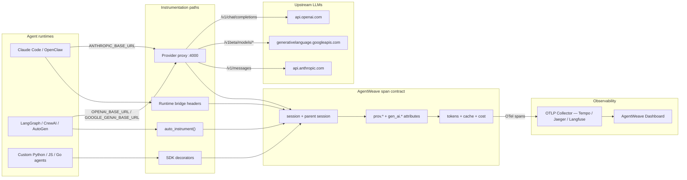
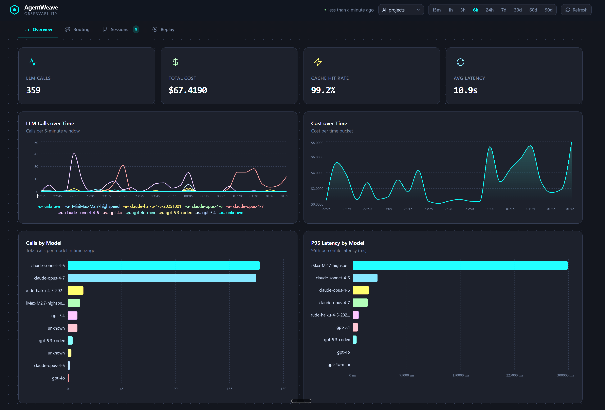
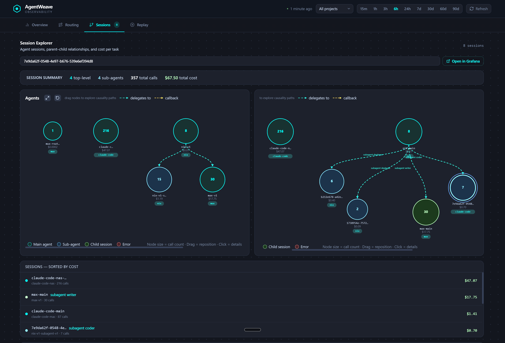
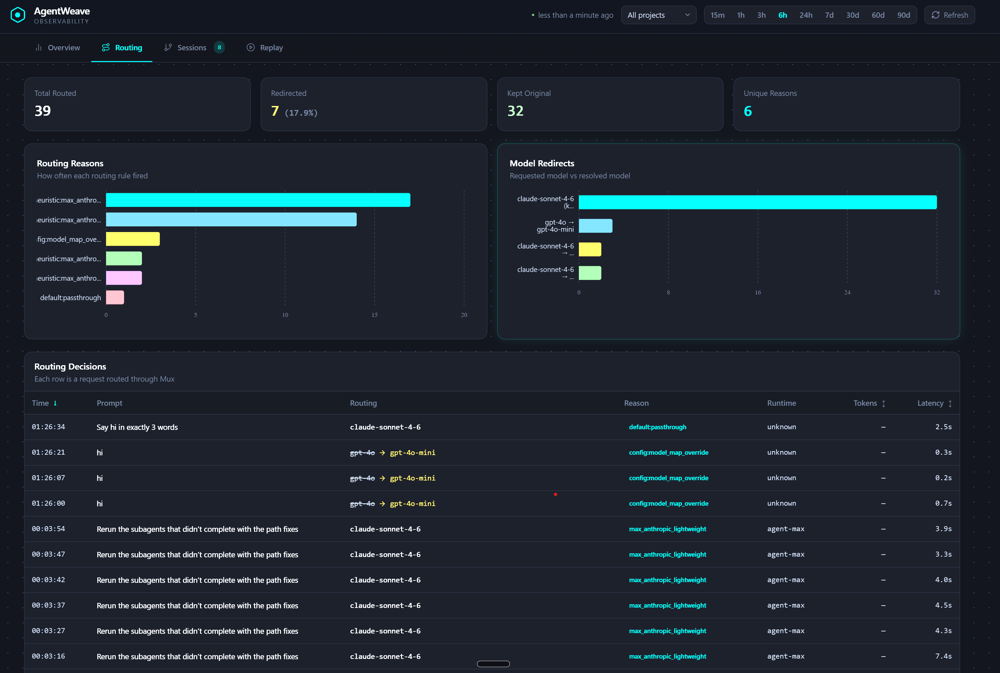
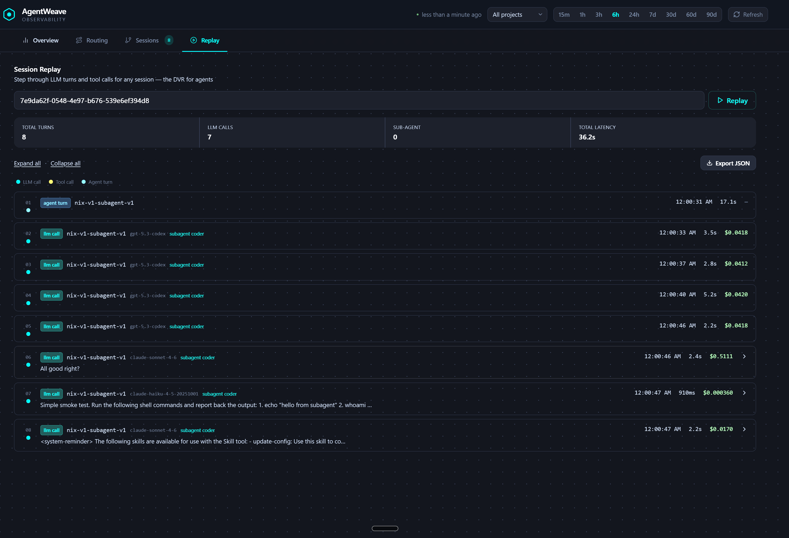
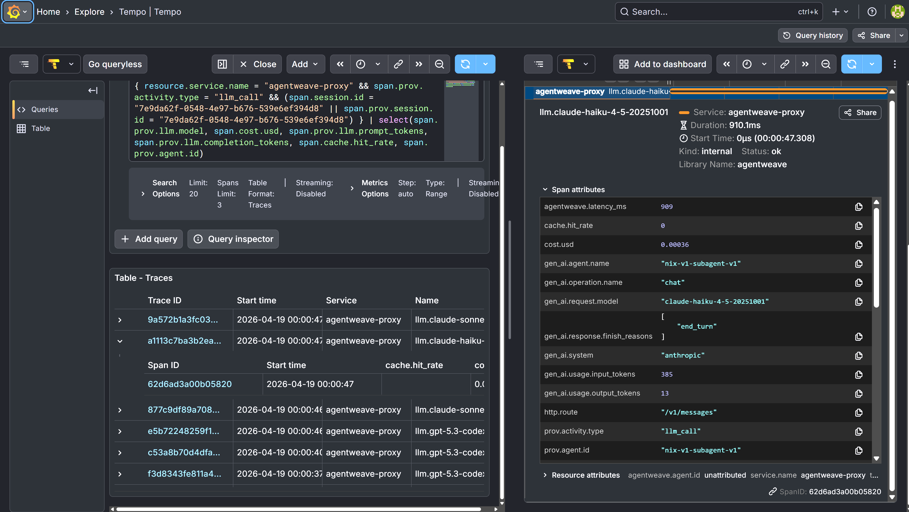

# AgentWeave

**Agent runtime observability and provenance layer for multi-agent AI systems.**

When agents delegate, loop, and fanout across tools and models, the final output tells you nothing. AgentWeave makes the decision chain the first-class artifact — every span carries [W3C PROV-O](https://www.w3.org/TR/prov-o/) provenance on [OpenTelemetry](https://opentelemetry.io/): which agent acted, which model ran, what was consumed, what was generated, and how much it cost.

Three paths to instrumentation: decorators, auto-instrumentation, or zero-code proxy. Any OTLP backend.

```
agent.nix                          94ms
├── llm.claude-sonnet-4-6          81ms  ← prompt_tokens=847, completion_tokens=312
├── tool.delegate_to_max           312ms
│   └── agent.max                  298ms
│       ├── llm.gemini-2.0-flash   187ms ← prompt_tokens=1203, completion_tokens=89
│       └── tool.web_search         94ms
├── llm.claude-sonnet-4-6          80ms  ← found it
└── tool.deploy_portfolio           48ms
```

## How it works



**Three paths to instrumentation:**

1. **Auto-instrumentation** (`auto_instrument()`) — one call patches Anthropic, OpenAI, and Google GenAI SDKs. No decorators needed.
2. **Decorators** (`@trace_agent`, `@trace_llm`, `@trace_tool`) — wrap your functions directly in Python, TypeScript, or Go. Zero infrastructure needed.
3. **Proxy** — point any agent's base URL at AgentWeave. It auto-detects the provider, forwards upstream, extracts token counts, and emits OTel spans. No code changes.

## Screenshots

<p align="center">
  
  <br>
  <em>Main dashboard overview (KPIs, latency, token/cost trends, and agent/model breakdowns)</em>
</p>

<p align="center">
  
  <br>
  <em>Session explorer view</em>
</p>

<p align="center">
  
  <br>
  <em>Routing view</em>
</p>

<p align="center">
  
  <br>
  <em>Replay / debug view</em>
</p>

<p align="center">
  
  <br>
  <em>Grafana / Tempo trace view</em>
</p>

## How AgentWeave fits in the ecosystem

Tools like [OpenLIT](https://openlit.io), [Langfuse](https://langfuse.com), and [LangSmith](https://smith.langchain.com) are good at answering: *what did my LLM do?* Token counts, latency, cost per request, prompt logging. If you have a single agent or a single app making LLM calls, those tools cover the problem well.

AgentWeave answers a different question: *what did my agent system do?*

When one agent delegates to another across different machines, frameworks, or providers, you lose the thread. A trace that stops at the process boundary tells you nothing about why the overall task failed, which agent introduced the bad output, or where the cost actually went.

| | OpenLIT / Langfuse / LangSmith | AgentWeave |
|---|---|---|
| Single-agent LLM tracing | Great | Basic |
| Cost and token tracking per request | Great | Supported |
| Prompt management, evals, playground | Yes (varies) | Out of scope |
| Cross-agent delegation traces | No | Core feature |
| Traces spanning multiple machines | No | Core feature |
| Proxy-based, zero code changes | No | Yes |
| Open source, self-hosted, no SaaS tier | Varies | Yes (MIT) |

**The intended use:** run OpenLIT or Langfuse inside each agent for deep per-agent observability, and point them all at AgentWeave for the system view above that. The delegation graph, cross-agent cost rollups, and traces that span process boundaries are what AgentWeave adds.

No cloud, no SaaS, no enterprise tier. Just the tool.

## Install

AgentWeave is in developer preview. Start with a local proxy and a local OTLP
collector; private dogfood deployments live in runbooks, not in the public
quickstart.

| SDK | Language | Install |
|-----|----------|---------|
| [sdk/python](./sdk/python) | Python | `pip install agentweave-sdk` |
| [sdk/js](./sdk/js) | TypeScript / JavaScript | `npm install agentweave-sdk` |
| [sdk/go](./sdk/go) | Go | `go get github.com/arniesaha/agentweave-go` |

### Local proxy path

```bash
pip install "agentweave-sdk[proxy]"
agentweave start --port 4000 --endpoint http://localhost:4318
export ANTHROPIC_BASE_URL=http://localhost:4000/v1
```

Use `agentweave status` to inspect the local proxy and `agentweave stop` when
you are done. `agentweave proxy start` remains available for foreground runs.

Use your normal provider API key in the client environment. Proxy-side key
injection and private NodePort URLs are dogfood-only conveniences, not required
for the public developer-preview path.

## Quickstart (Python)

### Option A — Auto-instrumentation (zero decorators)

```python
from agentweave import auto_instrument

auto_instrument()  # patches Anthropic, OpenAI, and Google GenAI SDKs automatically

# Supported SDK calls now emit OTel spans with token counts — no wrappers needed.
```

### Option B — Decorators (explicit control)

```python
from agentweave import AgentWeaveConfig, trace_agent, trace_llm, trace_tool

AgentWeaveConfig.setup(
    agent_id="my-agent-v1",
    agent_model="claude-sonnet-4-6",
    otel_endpoint="http://localhost:4318",
)

@trace_llm(provider="anthropic", model="claude-sonnet-4-6",
           captures_input=True, captures_output=True)
def call_claude(messages: list) -> ...:
    return client.messages.create(...)

@trace_tool(name="web_search", captures_input=True, captures_output=True)
def web_search(query: str) -> str:
    ...

@trace_agent(name="my-agent")
async def handle(message: str) -> str:
    response = call_claude(messages=[{"role": "user", "content": message}])
    return web_search(response.content[0].text)
```

All three spans link to the same trace ID. Open any OTLP backend and you see the waterfall.

## Framework Examples

| Framework | Example |
|-----------|---------|
| LangGraph | [examples/langgraph](./examples/langgraph) |
| CrewAI | [examples/crewai](./examples/crewai) |
| AutoGen | [examples/autogen](./examples/autogen) |
| OpenAI Agents SDK | [examples/openai-agents-sdk](./examples/openai-agents-sdk) |

## Auto-Instrumentation

Patch LLM SDK client methods with a single call — no decorators needed.

```python
from agentweave import auto_instrument, uninstrument

auto_instrument()                              # patch all detected SDKs
auto_instrument(providers=["anthropic"])        # selective
auto_instrument(captures_output=True)          # include response preview

uninstrument()                                 # restore originals
```

- Direct mode supports **Anthropic**, **OpenAI**, and **Google GenAI**, sync + async non-streaming calls
- Proxy mode rewrites provider base URLs so the AgentWeave proxy traces Anthropic, OpenAI-compatible, and Gemini-compatible traffic
- Composes with explicit `@trace_llm` — auto-instrumentation detects existing spans and skips to avoid double-tracing
- Idempotent — calling `auto_instrument()` twice is safe
- Direct streaming support is still limited; use the proxy path for streaming provider traffic

## Decorators

### `@trace_agent`

Root span for an agent turn. Nests all downstream tool and LLM calls.

```python
@trace_agent(name="nix")
def handle(message: str) -> str: ...
```

#### Session grouping

Pass `session_id` to group all spans from a single user conversation together.
The value is attached as `session.id` on every span, making it a filterable
dimension in Grafana / Tempo.

```python
@trace_agent(name="nix", session_id="conv-abc123")
def handle(message: str) -> str: ...
```

The proxy also accepts the `X-AgentWeave-Session-Id` header for zero-code
session tagging — see [docs/session-grouping.md](docs/session-grouping.md).

### `@trace_tool`

Span for any tool call — file ops, API calls, shell commands, A2A delegation.

```python
@trace_tool(name="delegate_to_max", captures_input=True, captures_output=True)
def delegate_to_max(task: str) -> dict: ...
```

### `@trace_llm`

Span for LLM invocations. Auto-extracts token counts and stop reason from Anthropic, OpenAI, and Google Gemini response shapes.

```python
@trace_llm(provider="anthropic", model="claude-sonnet-4-6", captures_output=True)
def call_claude(messages: list) -> anthropic.Message: ...
```

**Captured automatically:**
- `prov.llm.prompt_tokens` / `prov.llm.completion_tokens` / `prov.llm.total_tokens`
- `prov.llm.stop_reason`
- `prov.llm.response_preview` (first 512 chars, when `captures_output=True`)

## Sub-agent Attribution

When agents delegate to sub-agents, use the sub-agent attribution parameters to link child sessions to their parent and distinguish agent roles in traces.

### Python SDK

```python
# Main agent — tags itself as the root session
@trace_agent(name="nix", session_id="sess-main-123", agent_type="main", turn_depth=1)
def main_agent(msg: str) -> str:
    return delegate_to_sub(msg)

# Sub-agent — linked to parent session
@trace_agent(name="max", parent_session_id="sess-main-123",
             agent_type="subagent", turn_depth=2)
def sub_agent(task: str) -> str:
    return call_llm(task)
```

### Environment variable auto-detection

Set `AGENTWEAVE_PARENT_SESSION_ID` and the SDK auto-populates `prov.parent.session.id`, defaults `agent_type` to `"subagent"`, and `turn_depth` to `2`:

```bash
export AGENTWEAVE_PARENT_SESSION_ID=sess-main-123
```

### Proxy headers

When using the proxy, pass sub-agent context via HTTP headers:

| Header | Span attribute | Example |
|--------|---------------|---------|
| `X-AgentWeave-Parent-Session-Id` | `prov.parent.session.id` | `sess-main-123` |
| `X-AgentWeave-Agent-Type` | `prov.agent.type` | `subagent` |
| `X-AgentWeave-Turn-Depth` | `prov.session.turn` | `2` |

### TypeScript SDK

```typescript
import { traceAgent } from 'agentweave-sdk';

const subAgent = traceAgent({
  name: 'max',
  parentSessionId: 'sess-main-123',
  agentType: 'subagent',
  turnDepth: 2,
})(async (task: string) => {
  return callLlm(task);
});
```

### New span attributes

| Attribute | Description |
|---|---|
| `prov.parent.session.id` | ID of the parent session that spawned this sub-agent |
| `prov.agent.type` | `"main"`, `"subagent"`, or `"delegated"` |
| `prov.session.turn` | Turn depth: 1 = main session, 2 = first-level sub-agent |

## PROV-O Attributes

| Attribute | Description |
|---|---|
| `prov.activity.type` | `tool_call`, `agent_turn`, or `llm_call` |
| `prov.agent.id` | Agent identifier |
| `prov.agent.model` | Model name |
| `session.id` | OpenTelemetry-compatible session ID for grouping spans |
| `prov.session.id` | AgentWeave session ID for a user conversation, task, or run |
| `prov.parent.session.id` | Parent session ID when a delegated agent runs under another session |
| `prov.agent.type` | Agent role such as `main`, `subagent`, `delegated`, or `hook` |
| `prov.session.turn` | Turn or delegation depth within a session graph |
| `prov.project` | Project or app identity |
| `prov.task.label` | Human-readable label for the task this agent is executing |
| `prov.cwd` | Runtime working directory when available |
| `prov.repository` | Detected git repository name when available |
| `prov.used` | Serialized inputs consumed by the activity |
| `prov.wasGeneratedBy` | Output produced by the activity |
| `prov.wasAssociatedWith` | Agent responsible for the activity |
| `prov.llm.provider` | `anthropic`, `openai`, or `google` |
| `prov.llm.model` | Provider model name |
| `prov.llm.prompt_tokens` | Input token count |
| `prov.llm.completion_tokens` | Output token count |
| `prov.llm.total_tokens` | Total tokens |
| `prov.llm.stop_reason` | Why the model stopped |
| `cost.usd` | Estimated USD cost when model pricing and token usage are known |
| `tokens.cache_read` | Anthropic prompt-cache read tokens, or `0` for providers without cache data |
| `tokens.cache_write` | Anthropic prompt-cache write tokens, or `0` for providers without cache data |
| `cache.hit_rate` | Prompt-cache hit rate for providers that expose cache usage |

## OpenTelemetry GenAI Attributes

AgentWeave emits its provenance attributes and the OpenTelemetry GenAI semantic
attribute shape together, so downstream backends can use either convention.

| Attribute | Description |
|---|---|
| `gen_ai.operation.name` | `chat` for LLM calls and `invoke_agent` for agent turns |
| `gen_ai.provider.name` | Provider name such as `anthropic`, `openai`, or `google` |
| `gen_ai.system` | Legacy provider attribute kept for compatibility during the preview line |
| `gen_ai.request.model` | Requested model |
| `gen_ai.usage.input_tokens` | Input token count |
| `gen_ai.usage.output_tokens` | Output token count |
| `gen_ai.response.finish_reasons` | Provider finish/stop reasons |
| `gen_ai.agent.name` | Agent identity when known |

Full schema: [`sdk/python/agentweave/schema.py`](sdk/python/agentweave/schema.py)

## Proxy — zero-code observability

For agents you can't instrument with decorators (Claude Code, Node.js, any runtime), run the **AgentWeave proxy** — a transparent HTTP server that sits between your agents and their LLM providers. Works with Claude Code out of the box — just set `ANTHROPIC_BASE_URL` in `~/.claude/settings.json` ([setup guide](docs/claude-code-proxy.md)).

```bash
pip install "agentweave-sdk[proxy]"
agentweave start --port 4000 --endpoint http://localhost:4318

# Point agents at the proxy — no code changes needed
export ANTHROPIC_BASE_URL=http://localhost:4000/v1
export OPENAI_BASE_URL=http://localhost:4000/v1
export GOOGLE_GENAI_BASE_URL=http://localhost:4000
export AGENTWEAVE_AGENT_ID=my-agent
```

Use `agentweave status` to inspect the background proxy and `agentweave stop`
to stop it. For foreground runs, `agentweave proxy start ...` is still
available.

**OpenAI/Codex streaming note:**
- `/v1/chat/completions` needs `stream_options.include_usage=true` for token usage
- `/v1/responses` and `/codex/responses` do **not** support `stream_options`; usage should arrive in the final `response.completed` event
- AgentWeave handles this difference in the proxy so the traced spans still get tokens/cost when upstream provides them

One port, all providers. Every LLM call gets a span automatically.

> Docker / k8s setup: see [`deploy/docker/Dockerfile`](deploy/docker/Dockerfile)

## Backends

AgentWeave emits standard OTLP HTTP — works with any compatible backend:

| Backend | Endpoint |
|---|---|
| **Grafana Tempo** | `http://tempo:4318` — recommended for self-hosted |
| **Jaeger** | `http://jaeger:4318` |
| **Langfuse v3** | `https://cloud.langfuse.com/api/public/otel` |
| **Console (dev)** | `from agentweave import add_console_exporter; add_console_exporter()` |

## Docs

| Topic | Doc |
|-------|-----|
| Claude Code proxy setup | [docs/claude-code-proxy.md](./docs/claude-code-proxy.md) |
| OpenClaw bridge install | [plugins/openclaw-agentweave-bridge/INSTALL.md](./plugins/openclaw-agentweave-bridge/INSTALL.md) |
| Session grouping | [docs/session-grouping.md](./docs/session-grouping.md) |
| Proxy setup | [docs/proxy-setup.md](./docs/proxy-setup.md) |
| Production hardening | [docs/production-hardening.md](./docs/production-hardening.md) |
| Provider compatibility | [docs/compatibility.md](./docs/compatibility.md) |
| Deterministic trace IDs | [docs/deterministic-trace-ids.md](./docs/deterministic-trace-ids.md) |
| Span linking design | [docs/span-linking-design.md](./docs/span-linking-design.md) |
| Proxy benchmarks | [docs/benchmarks.md](./docs/benchmarks.md) |
| Versioning policy | [docs/versioning.md](./docs/versioning.md) |

Install the OpenClaw bridge on any host with one command:

```bash
agentweave openclaw install --proxy-url <proxy> --otlp-endpoint <otlp> --agent-id "$(hostname)"
```

## Development

```bash
git clone https://github.com/arniesaha/agentweave && cd agentweave
pip install -e "./sdk/python[dev]"

pytest sdk/python/tests tests -q                    # Python SDK + repo tests
(cd sdk/js && npm ci && npx jest --verbose)           # 10 TypeScript tests
(cd sdk/go && go test ./... -v)                       # 4 Go tests
```

## License

MIT
