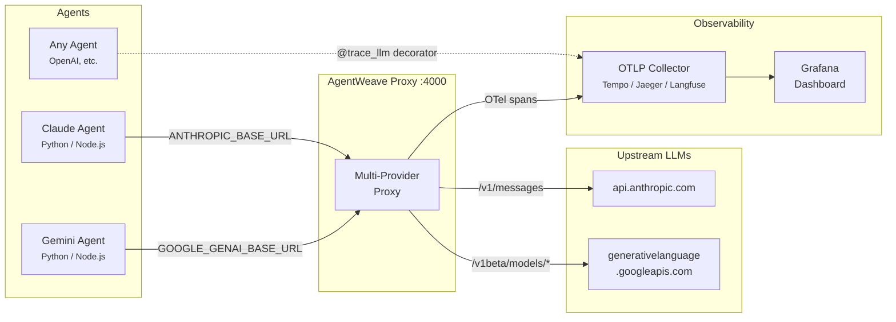

# AgentWeave

Enabling transparent observability and decision provenance for distributed multi-agent systems. **AgentWeave** captures and forwards context-rich traces from AI agents, allowing developers to monitor, debug, and optimize interactions across multiple SDKs and environments.

## Architecture



## Choose Your SDK

| SDK | Language | Install | Status |
|-----|----------|---------|--------|
| [sdk-python](./sdk-python) | Python | `pip install agentweave-sdk` | ✅ v0.1.1 |
| [sdk-js](./sdk-js) | TypeScript / JavaScript | `npm install agentweave` | ✅ v0.1.0 |
| [sdk-go](./sdk-go) | Go | coming soon | 🚧 |
| [proxy](./proxy) | Docker / k8s | `docker pull ghcr.io/arniesaha/agentweave` | ✅ v0.1.1 |

> **Note:** Python is AgentWeave's primary SDK. See below for a quickstart.

### Quickstart (Python SDK)

```bash
pip install agentweave-sdk
```

```python
from agentweave import AgentWeaveConfig, trace_agent, trace_llm, trace_tool

# Configure tracing to your OTLP backend
AgentWeaveConfig.setup(
    agent_id="my-agent-v1",
    agent_model="claude-sonnet-4-6",
    otel_endpoint="http://localhost:4318",
)

@trace_llm(provider="anthropic", captures_input=True, captures_output=True)
def call_model(prompt):
    return model.generate(prompt)

@trace_agent(name="my-agent")
def interact(prompt):
    response = call_model(prompt)
    return response
```

See the full documentation for [sdk-python](./sdk-python).

---

For deeper customization, you can also set up our transparent proxy to capture traces for unsupported SDKs!