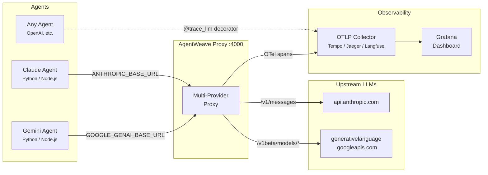
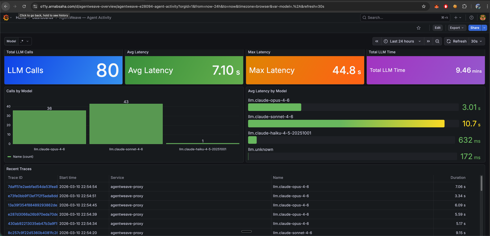

# AgentWeave

Observability for multi-agent AI systems. Track what your agents decided, why they decided it, and how much it cost.

Three decorators. Full decision provenance. Works with any OTLP backend.

```
agent.nix                          94ms
├── llm.claude-sonnet-4-6          81ms  ← prompt_tokens=847, completion_tokens=312
├── tool.image_search               52ms
├── llm.claude-sonnet-4-6          79ms  ← prompt_tokens=847, completion_tokens=312
├── tool.image_search               51ms
├── llm.claude-sonnet-4-6          80ms  ← found it
└── tool.deploy_portfolio           48ms
```

When an agent delegates to another agent, calls an LLM ten times, and finally deploys a result — you see the output but not the chain. AgentWeave makes the chain the first-class artifact. Every span carries [W3C PROV-O](https://www.w3.org/TR/prov-o/) provenance on [OpenTelemetry](https://opentelemetry.io/): what was consumed, what was generated, which agent made the call, which model ran it.

## How it works



**Two paths to instrumentation:**

1. **Decorators** (`@trace_agent`, `@trace_llm`, `@trace_tool`) — wrap your functions directly in Python, TypeScript, or Go. Zero infrastructure needed.
2. **Proxy** — point any agent's base URL at AgentWeave. It auto-detects the provider, forwards upstream, extracts token counts, and emits OTel spans. No code changes.

<p align="center">
  
  <br>
  <em>AgentWeave dashboard — 80 LLM calls across Claude Opus, Sonnet, and Haiku with latency breakdowns and live trace feed</em>
</p>

## Install

| SDK | Language | Install |
|-----|----------|---------|
| [sdk/python](./sdk/python) | Python | `pip install agentweave-sdk` |
| [sdk/js](./sdk/js) | TypeScript / JavaScript | `npm install agentweave` |
| [sdk/go](./sdk/go) | Go | `go get github.com/arniesaha/agentweave-go` |

## Quickstart (Python)

```python
from agentweave import AgentWeaveConfig, trace_agent, trace_llm, trace_tool

AgentWeaveConfig.setup(
    agent_id="my-agent-v1",
    agent_model="claude-sonnet-4-6",
    otel_endpoint="http://localhost:4318",
)

@trace_llm(provider="anthropic", model="claude-sonnet-4-6",
           captures_input=True, captures_output=True)
def call_claude(messages: list) -> ...:
    return client.messages.create(...)

@trace_tool(name="web_search", captures_input=True, captures_output=True)
def web_search(query: str) -> str:
    ...

@trace_agent(name="my-agent")
async def handle(message: str) -> str:
    response = call_claude(messages=[{"role": "user", "content": message}])
    return web_search(response.content[0].text)
```

All three spans link to the same trace ID. Open any OTLP backend and you see the waterfall.

## Decorators

### `@trace_agent`

Root span for an agent turn. Nests all downstream tool and LLM calls.

```python
@trace_agent(name="nix")
def handle(message: str) -> str: ...
```

### `@trace_tool`

Span for any tool call — file ops, API calls, shell commands, A2A delegation.

```python
@trace_tool(name="delegate_to_max", captures_input=True, captures_output=True)
def delegate_to_max(task: str) -> dict: ...
```

### `@trace_llm`

Span for LLM invocations. Auto-extracts token counts and stop reason from Anthropic, OpenAI, and Google Gemini response shapes.

```python
@trace_llm(provider="anthropic", model="claude-sonnet-4-6", captures_output=True)
def call_claude(messages: list) -> anthropic.Message: ...
```

**Captured automatically:**
- `prov.llm.prompt_tokens` / `prov.llm.completion_tokens` / `prov.llm.total_tokens`
- `prov.llm.stop_reason`
- `prov.llm.response_preview` (first 512 chars, when `captures_output=True`)

## PROV-O Attributes

| Attribute | Description |
|---|---|
| `prov.activity.type` | `tool_call`, `agent_turn`, or `llm_call` |
| `prov.agent.id` | Agent identifier |
| `prov.agent.model` | Model name |
| `prov.used` | Serialized inputs consumed by the activity |
| `prov.wasGeneratedBy` | Output produced by the activity |
| `prov.wasAssociatedWith` | Agent responsible for the activity |
| `prov.llm.provider` | `anthropic`, `openai`, or `google` |
| `prov.llm.prompt_tokens` | Input token count |
| `prov.llm.completion_tokens` | Output token count |
| `prov.llm.total_tokens` | Total tokens |
| `prov.llm.stop_reason` | Why the model stopped |

Full schema: [`sdk/python/agentweave/schema.py`](sdk/python/agentweave/schema.py)

## Proxy — zero-code observability

For agents you can't instrument with decorators (Claude Code, Node.js, any runtime), run the **AgentWeave proxy** — a transparent HTTP server that sits between your agents and their LLM providers. Works with Claude Code out of the box — just set `ANTHROPIC_BASE_URL` in `~/.claude/settings.json` ([setup guide](docs/claude-code-proxy.md)).

```bash
pip install "agentweave[proxy]"
agentweave proxy start --port 4000 --endpoint http://localhost:4318 --agent-id my-agent

# Point agents at the proxy — no code changes needed
export ANTHROPIC_BASE_URL=http://localhost:4000
export GOOGLE_GENAI_BASE_URL=http://localhost:4000
```

One port, all providers. Every LLM call gets a span automatically.

> Docker / k8s setup: see [`deploy/docker/Dockerfile`](deploy/docker/Dockerfile)

## Backends

AgentWeave emits standard OTLP HTTP — works with any compatible backend:

| Backend | Endpoint |
|---|---|
| **Grafana Tempo** | `http://tempo:4318` — recommended for self-hosted |
| **Jaeger** | `http://jaeger:4318` |
| **Langfuse v3** | `https://cloud.langfuse.com/api/public/otel` |
| **Console (dev)** | `from agentweave import add_console_exporter; add_console_exporter()` |

## Development

```bash
git clone https://github.com/arniesaha/agentweave && cd agentweave
pip install -e "./sdk/python[dev]"

pytest sdk/python                                    # 31 Python tests
(cd sdk/js && npm ci && npx jest --verbose)           # 10 TypeScript tests
(cd sdk/go && go test ./... -v)                       # 4 Go tests
```

## License

MIT
