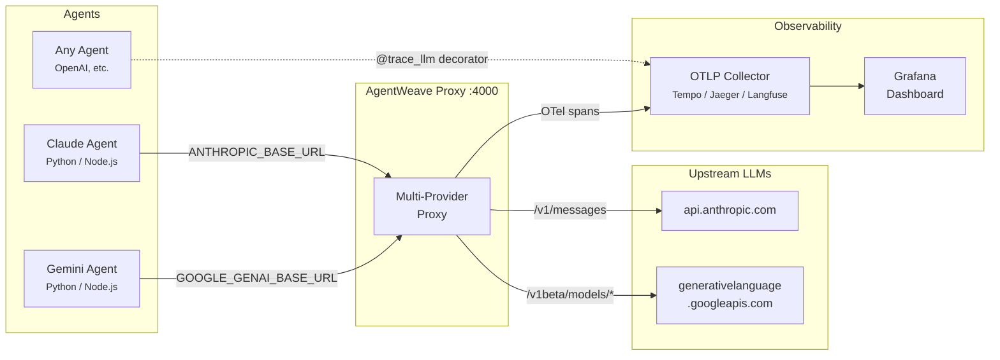

# AgentWeave

Observability for multi-agent AI systems. Track what your agents decided, why they decided it, and how much it cost.

AgentWeave wraps your Python agent code with [W3C PROV-O](https://www.w3.org/TR/prov-o/) compatible [OpenTelemetry](https://opentelemetry.io/) spans. Three decorators. Full decision provenance. Works with any OTLP backend.

<p align="center">
  
  <br>
  <em>Trace waterfall in Grafana Tempo — a Gemini 2.5 Pro call with PROV-O span attributes (model, provider, agent ID, latency)</em>
</p>

<p align="center">
  
  <br>
  <em>Multi-provider trace list — Gemini and Claude Sonnet calls from the same proxy, one unified view</em>
</p>

## Architecture



**How it works:** Agents point their SDK base URL at the proxy. The proxy auto-detects the provider from the request path, forwards the call upstream, extracts token counts and metadata, and emits an OTel span — all transparently. For Python agents, you can also use the `@trace_llm` / `@trace_tool` / `@trace_agent` decorators directly.

## Why

When an agent delegates to another agent, calls an LLM ten times searching for a photo, and finally deploys a result — none of that is visible today. You see the output. You don't see the chain.

AgentWeave makes the chain the first-class artifact:

```
agent.nix                          94ms
├── llm.claude-sonnet-4-6          81ms  ← prompt_tokens=847, completion_tokens=312
├── tool.image_search               52ms
├── llm.claude-sonnet-4-6          79ms  ← prompt_tokens=847, completion_tokens=312
├── tool.image_search               51ms
├── llm.claude-sonnet-4-6          80ms  ← found it
└── tool.deploy_portfolio           48ms
```

Every span carries PROV-O provenance: what was consumed, what was generated, which agent made the call, which model ran it.

## Install

```bash
pip install agentweave
```

## Quickstart

```python
from agentweave import AgentWeaveConfig, trace_agent, trace_llm, trace_tool

# One-time setup — point at any OTLP HTTP endpoint
AgentWeaveConfig.setup(
    agent_id="my-agent-v1",
    agent_model="claude-sonnet-4-6",
    otel_endpoint="http://localhost:4318",  # Grafana Tempo, Jaeger, etc.
)

# Wrap your LLM calls
@trace_llm(provider="anthropic", model="claude-sonnet-4-6",
           captures_input=True, captures_output=True)
def call_claude(messages: list) -> ...:
    return client.messages.create(...)

# Wrap your tool calls
@trace_tool(name="web_search", captures_input=True, captures_output=True)
def web_search(query: str) -> str:
    ...

# Wrap your agent turns
@trace_agent(name="my-agent")
async def handle(message: str) -> str:
    response = call_claude(messages=[{"role": "user", "content": message}])
    return web_search(response.content[0].text)
```

That's it. All three spans link to the same trace ID. Open Grafana Tempo (or any OTLP backend) and you see the waterfall.

## Decorators

### `@trace_agent`

Root span for an agent turn. Nests all downstream tool and LLM calls.

```python
@trace_agent(name="nix", captures_input=True, captures_output=True)
def handle(message: str) -> str: ...
```

### `@trace_tool`

Span for any tool call — file ops, API calls, shell commands, A2A delegation.

```python
@trace_tool(name="delegate_to_max", captures_input=True, captures_output=True)
def delegate_to_max(task: str) -> dict: ...
```

### `@trace_llm`

Span for LLM invocations. Auto-extracts token counts and stop reason from the response (Anthropic, OpenAI, and Google Gemini conventions supported).

```python
@trace_llm(provider="anthropic", model="claude-sonnet-4-6",
           captures_input=True, captures_output=True)
def call_claude(messages: list) -> anthropic.Message: ...

@trace_llm(provider="google", model="gemini-2.5-pro",
           captures_input=True, captures_output=True)
def call_gemini(contents: list) -> genai.GenerateContentResponse: ...
```

**Captured automatically:**
- `prov.llm.prompt_tokens` / `prov.llm.completion_tokens` / `prov.llm.total_tokens`
- `prov.llm.stop_reason` (`end_turn`, `tool_use`, `STOP`, etc.)
- `prov.llm.prompt_preview` and `prov.llm.response_preview` (first 512 chars, when `captures_input/output=True`)

## PROV-O Attributes

| Attribute | Description |
|---|---|
| `prov.activity` | Name of the activity (tool/agent/llm) |
| `prov.activity.type` | `tool_call`, `agent_turn`, or `llm_call` |
| `prov.agent.id` | Agent identifier |
| `prov.agent.model` | Model name |
| `prov.used` | Serialized inputs consumed by the activity |
| `prov.wasGeneratedBy` | Output produced by the activity |
| `prov.wasAssociatedWith` | Agent responsible for the activity |
| `prov.llm.provider` | LLM provider (`anthropic`, `openai`, `google`) |
| `prov.llm.model` | Model name |
| `prov.llm.prompt_tokens` | Input token count |
| `prov.llm.completion_tokens` | Output token count |
| `prov.llm.total_tokens` | Total tokens |
| `prov.llm.stop_reason` | Why the model stopped |

Full schema: [`agentweave/schema.py`](agentweave/schema.py)

## Proxy — multi-provider observability gateway

For agents you can't instrument with decorators (Node.js, Claude Code, OpenClaw), run the **AgentWeave proxy** — a transparent HTTP server that sits between your agents and their LLM providers.

The proxy auto-detects the provider from the request path:

| Path pattern | Provider | Upstream |
|---|---|---|
| `/v1/messages` | Anthropic | `api.anthropic.com` |
| `/v1beta/models/...` | Google Gemini | `generativelanguage.googleapis.com` |
| `/v1/models/...` | Google Gemini | `generativelanguage.googleapis.com` |

```bash
pip install "agentweave[proxy]"
agentweave proxy start --port 4000 --endpoint http://localhost:4318 --agent-id my-agent
```

Point your agents at the proxy:

```bash
# Anthropic agents
export ANTHROPIC_BASE_URL=http://localhost:4000

# Google Gemini agents
export GOOGLE_GENAI_BASE_URL=http://localhost:4000
```

One port, all providers. Every LLM call gets a span — no SDK changes, no framework lock-in.

> Full setup guide: [docs/proxy-setup.md](docs/proxy-setup.md)

## Backends

AgentWeave emits standard OTLP HTTP — works with any compatible backend:

| Backend | Setup |
|---|---|
| **Grafana Tempo** | `otel_endpoint="http://tempo:4318"` — recommended for self-hosted |
| **Jaeger** | `otel_endpoint="http://jaeger:4318"` |
| **Langfuse v3** | `otel_endpoint="https://cloud.langfuse.com/api/public/otel"` + auth headers |
| **Any OTel Collector** | Point at the collector's OTLP HTTP receiver |
| **Console (dev)** | `from agentweave import add_console_exporter; add_console_exporter()` |

## Development

```bash
git clone https://github.com/arniesaha/agentweave
cd agentweave
pip install -e ".[dev]"
pytest                          # 24 tests
python examples/simple_agent.py
python examples/nix_max_delegation.py
```

## License

MIT
